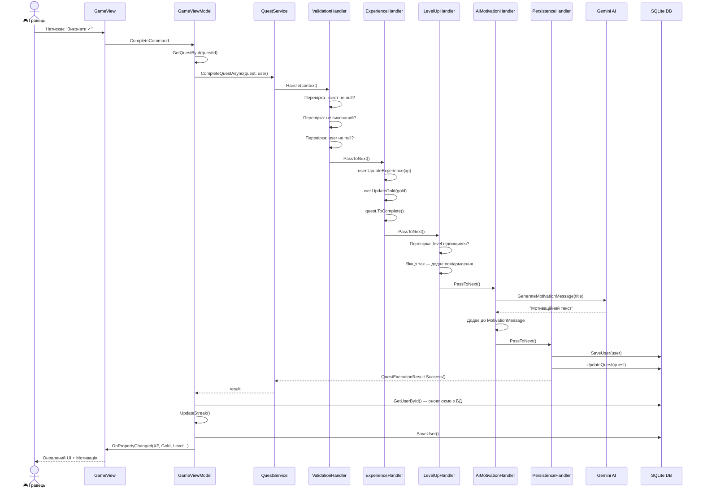

# Sequence Diagram — Виконання квесту

```mermaid
sequenceDiagram
    actor Player as 🎮 Гравець
    participant UI as GameView
    participant VM as GameViewModel
    participant QS as QuestService
    participant VH as ValidationHandler
    participant EH as ExperienceHandler
    participant LH as LevelUpHandler
    participant AH as AiMotivationHandler
    participant PH as PersistenceHandler
    participant AI as Gemini AI
    participant DB as SQLite DB

    Player->>UI: Натискає "Виконати ✓"
    UI->>VM: CompleteCommand
    VM->>VM: GetQuestById(questId)
    VM->>QS: CompleteQuestAsync(quest, user)
    
    QS->>VH: Handle(context)
    VH->>VH: Перевірка: квест не null?
    VH->>VH: Перевірка: не виконаний?
    VH->>VH: Перевірка: user не null?
    VH->>EH: PassToNext()
    
    EH->>EH: user.UpdateExperience(xp)
    EH->>EH: user.UpdateGold(gold)
    EH->>EH: quest.ToComplete()
    EH->>LH: PassToNext()
    
    LH->>LH: Перевірка: level підвищився?
    LH->>LH: Якщо так — додає повідомлення
    LH->>AH: PassToNext()
    
    AH->>AI: GenerateMotivationMessage(title)
    AI-->>AH: "Мотиваційний текст"
    AH->>AH: Додає до MotivationMessage
    AH->>PH: PassToNext()
    
    PH->>DB: SaveUser(user)
    PH->>DB: UpdateQuest(quest)
    PH-->>QS: QuestExecutionResult.Success()
    
    QS-->>VM: result
    VM->>DB: GetUserById() — оновлюємо з БД
    VM->>VM: UpdateStreak()
    VM->>DB: SaveUser()
    VM->>UI: OnPropertyChanged(XP, Gold, Level...)
    UI-->>Player: Оновлений UI + Мотивація
```