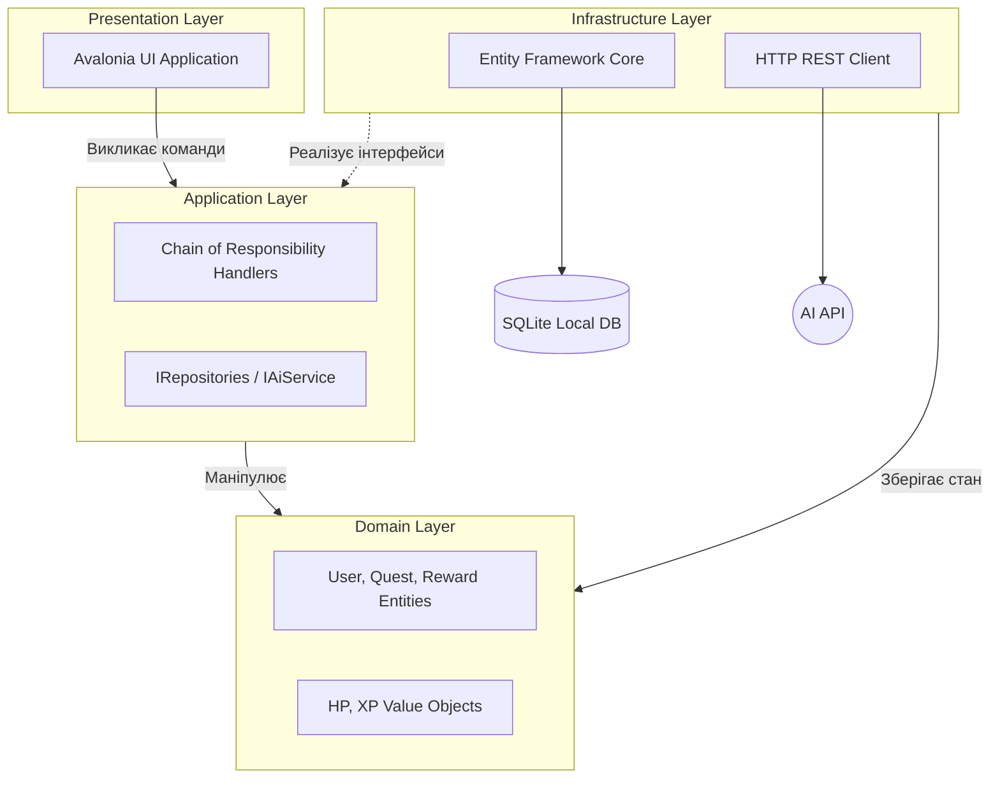
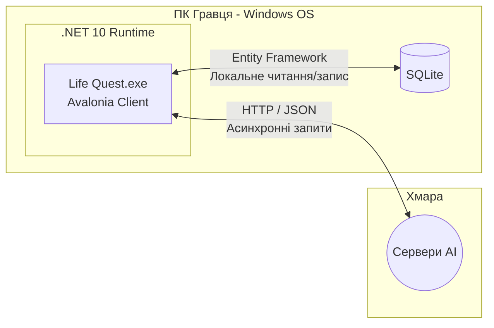
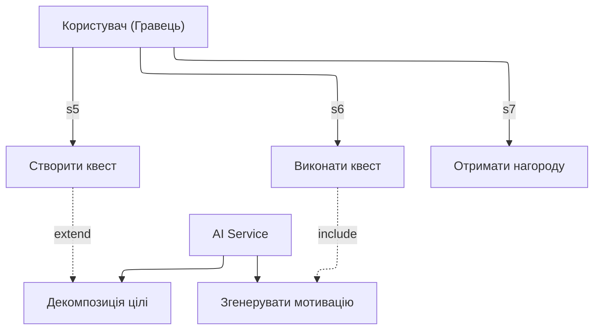
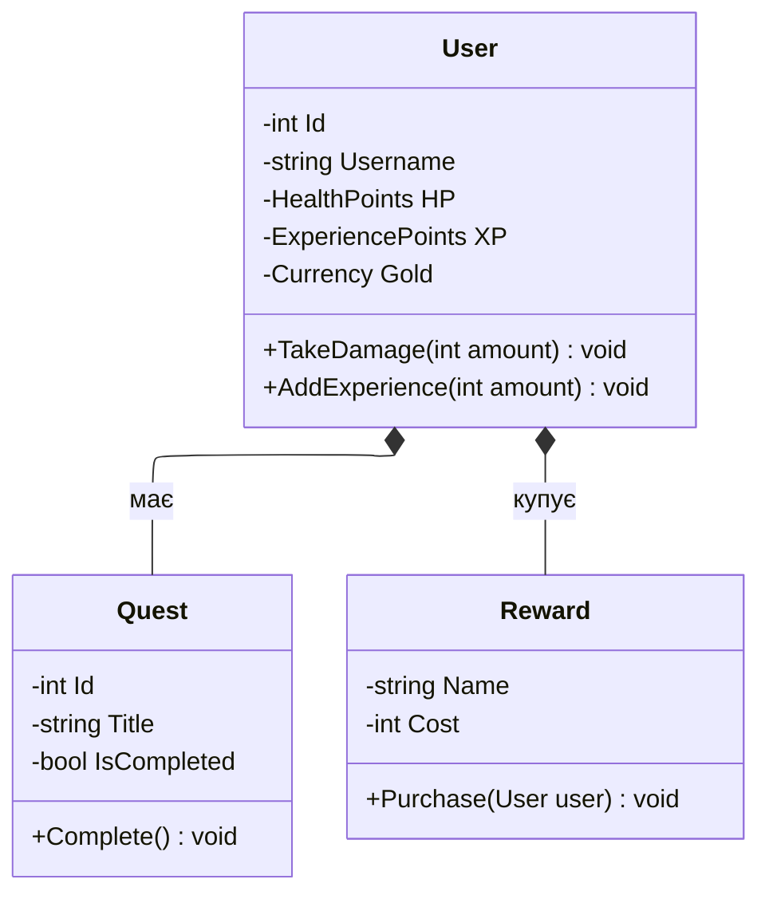
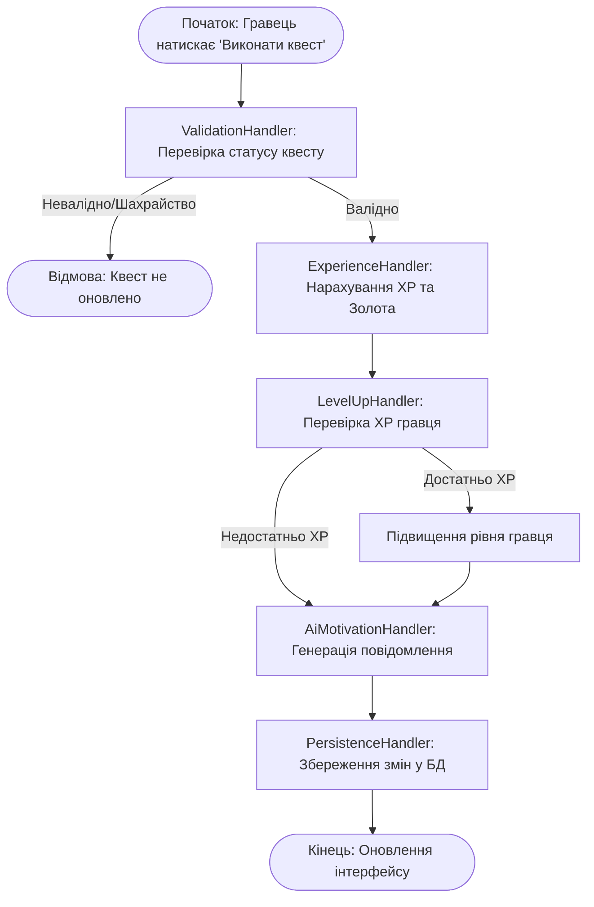
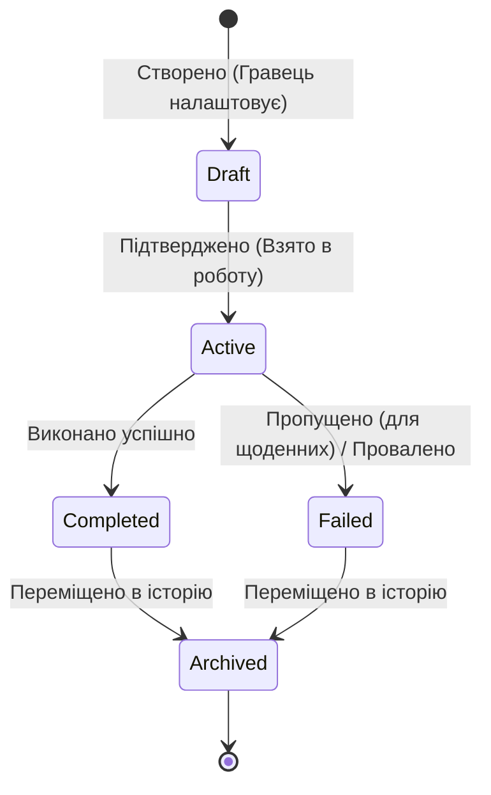

# Diagrams wich we used for project:

## Component Diagram
Як наш код розбитий на модулі.

## Deployment Diagram
На якій платформі та в якому середовищі все це буде працювати.

## Use Case Diagram

## Class Diargam (Domain)

## Activity Diagram
Показує як працює наш патерн Chain of Responsibility.

## State Machine Diagram
Життєвий цикл одного об'єкта: сутність Quest.

